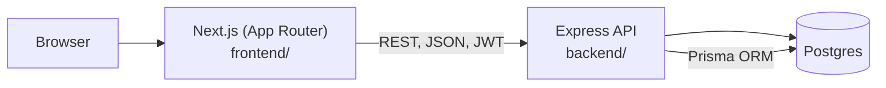
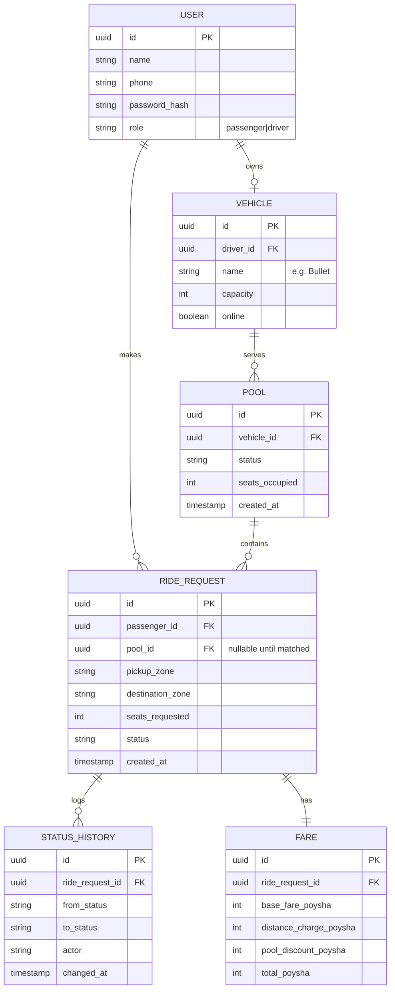

# Architecture — Dhaka Tesla Pool

> **Status:** Living document. Implementation should broadly match this; if it drifts,
> update this file and log the reason in `memory.md`.

## 1. System Diagram



Three containers via Docker Compose: `frontend`, `backend`, `postgres`. Frontend and
backend are deliberately separate processes (not a single Next.js fullstack app) per
the assignment's mandated stack.

## 2. Stack & Justification (full version goes in README §7 as required)

| Layer | Choice | Why (short version) | Alternative considered | Would switch if |
|---|---|---|---|---|
| Frontend | Next.js (App Router) | Already know it; SSR/routing not really needed here but no cost either | Plain React + Vite | N/A, fine as-is |
| Backend | **Express** | Minimal ceremony, fastest to learn well in 3 days, huge doc/community coverage | NestJS | Team grows / need enforced module structure & DI |
| ORM | **Prisma** | Fast migrations, type-safe queries, easy seed scripts, plays well with Docker | Raw SQL / Knex | Need very custom query perf tuning at scale |
| DB | **Postgres** | Relational integrity for capacity/pool constraints; matches brief's recommendation | SQLite | N/A — Postgres chosen deliberately |
| Auth | **JWT + bcrypt** | Stateless, simple, no session store needed for MVP | Session cookies | Need server-side revocation / multi-device session mgmt |
| API style | **REST** | Small, resource-shaped domain (users/rides/pools) — REST maps cleanly, no need for GraphQL's flexibility | GraphQL | Frontend needed highly flexible/nested querying |

*(This table is the seed for the required README justification — expand with "realistic
alternatives" prose there.)*

## 3. API Surface (draft — will grow; keep this in sync with actual routes)

```
POST   /auth/signup
POST   /auth/login

POST   /rides                 (passenger: request a ride)
GET    /rides/:id              (passenger/driver: own ride only)
GET    /rides/mine             (passenger: own history)
PATCH  /rides/:id/cancel

GET    /driver/requests        (driver: relevant open requests)
POST   /driver/rides/:id/accept
PATCH  /driver/rides/:id/arrive
PATCH  /driver/rides/:id/start
PATCH  /driver/rides/:id/complete
GET    /driver/rides           (driver: own ride history)

GET    /vehicles/mine          (driver: own vehicle info)
```

## 4. ERD



*(This is a starting point — exact fields will be refined once Prisma schema is
written; update this diagram to match reality, don't let it go stale.)*

## 5. Concurrency Handling

The seat-claim race (Nusrat & Shirin both grab Bullet's last seat) is handled with a
single atomic conditional update inside a DB transaction:

```sql
UPDATE pool
SET seats_occupied = seats_occupied + :n
WHERE id = :pool_id AND seats_occupied + :n <= capacity;
```

Check rows-affected — 0 means someone else won the seat, return a clean "seat no
longer available" error. No row-level locking or queueing needed at MVP scale.
Full rationale and the "what changes at scale" answer → `rules.md` + `memory.md`.

## 6. Docker Compose Outline

```yaml
services:
  frontend:   # Next.js, depends_on backend
  backend:    # Express + Prisma, depends_on postgres, runs migrations on start
  postgres:   # postgres:16-alpine, volume for data, healthcheck
```

`.env.example` at repo root covers: `DATABASE_URL`, `JWT_SECRET`, `PORT`,
`NEXT_PUBLIC_API_URL`. Never commit real `.env`.

## 7. Deployment

- Frontend → Vercel (free tier)
- Backend + Postgres → Render or Railway free tier
- Fallback if free hosting doesn't cooperate: documented, reproducible
  `docker compose up` deployment, stated clearly in README as the constraint

## 8. Folder Structure (sketch)

```
/frontend        Next.js app
/backend
  /src
    /routes
    /controllers
    /services      ← business logic (matching, fare calc, state machine)
    /middleware    ← auth, validation, error handling
  /prisma
    schema.prisma
    seed.ts
/docker-compose.yml
/.env.example
```