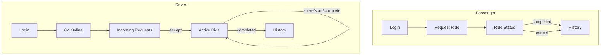

# Design — Dhaka Tesla Pool (Frontend / UX)

> **Status:** Living document. Screens/flows may be simplified further if time is
> short on Day 2 — log any cut scope in `memory.md` rather than just quietly skipping it.

## 1. Principles

- Simple and clean beats polished-but-fragile — the brief explicitly says "a simple,
  clean interface is enough" and separately warns against polishing animations while
  data integrity is broken.
- Every screen must handle **loading, error, empty, and success** states — this is
  explicitly scored.
- The cast is visible in the UI (names, not "User #4") — makes the demo readable.

## 2. Screens

### Passenger
| Screen | Purpose | States to handle |
|---|---|---|
| Sign up / Login | Auth | loading, validation error, success |
| Request Ride | Pick pickup/destination zone + seats, see estimated fare before submitting | loading (fare calc), invalid zone combo |
| Ride Status | Live-ish status tracker (poll or refresh): waiting → matched → in progress → completed | empty (no active ride), each lifecycle stage, cancelled |
| Ride History | Past rides list with fare + status | empty (no history yet), loading |
| Cancel | Confirm + cancel while allowed | disabled once not cancellable, error if race lost |

### Driver
| Screen | Purpose | States to handle |
|---|---|---|
| Sign in | Auth | same as passenger |
| Dashboard / Online-Offline | Toggle availability | offline empty state, online-no-requests state |
| Incoming Requests | List of relevant open requests, accept/pool | loading, empty ("no requests nearby") |
| Active Ride | Current passengers, seats used/total, pool membership, stage controls (arrive/start/complete) | mid-lifecycle, error on invalid transition attempt |
| Ride History | Past rides for this vehicle | empty, loading |

## 3. Navigation Flow

## 4. Shared Components (sketch — refine once building)

- `StatusBadge` — colored pill per lifecycle stage
- `FareDisplay` — shows amount in ৳ (converted from poysha at render time only)
- `PoolIndicator` — "Shared with Rafiq" style badge when `seats_occupied > 1`
- `RideCard` — summary row used in both history and incoming-requests lists
- `ZonePicker` — dropdown from the fixed zone enum (no free text, no map)

## 5. Visual Style (placeholder — not the priority, functionality is)

- Tailwind CSS, neutral palette, one accent color for primary actions
- No custom illustrations/animations for MVP — cut first if time is short